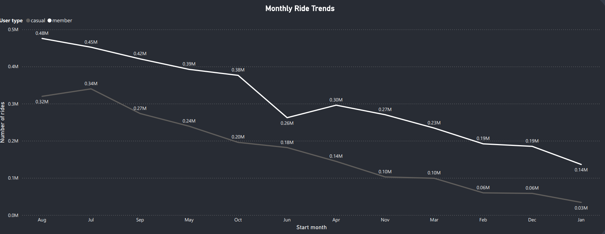
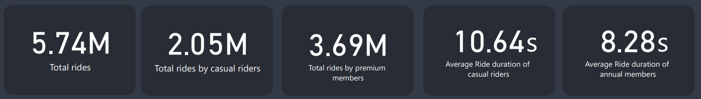
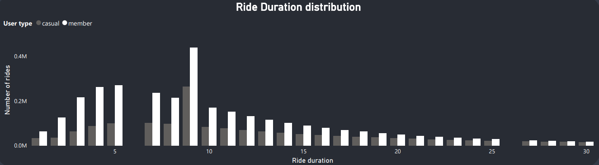

# Bike Rides Analytics Project

 
Analyze bike ride data to differentiate casual riders from premium members and develop strategies to convert casual riders, enhancing profitability. This project includes data cleaning, exploratory data analysis, and insightful visualizations.

 
 
 

  

 
 

## Table of Contents
1. [Introduction](#introduction)
2. [Data Collection](#data-collection)
3. [Data Cleaning and Processing](#data-cleaning-and-processing)
4. [Exploratory Data Analysis](#exploratory-data-analysis)
5. [Insights and Visualizations](#insights-and-visualizations)
6. [Conclusion](#conclusion)
7. [References](#references)

 
 
 

## Introduction

This project aims to analyze bike rides data to determine the difference between casual riders and premium members. The goal is to increase profits by converting casual riders into premium members.

 
 

## Data Collection

The dataset consists of multiple CSV files for each month. The data includes the following attributes:

- Ride ID
- Ride Type (casual or member)
- Start Time
- End Time
- Start Station
- End Station
- Bike Type

 
 

## Data Cleaning and Processing

Data cleaning and processing were performed using SQL and Excel. The steps involved:

1. Removing duplicates
2. Handling missing values
3. Converting data types
4. Creating new features

 

  

 

## Exploratory Data Analysis
Exploratory Data Analysis (EDA) was conducted to understand the data better. Here are some key visualizations:

  

 *Figure 1: Number of Rides by Month* 

 
 

 *Figure 2: Average Ride Duration by User Type* 

 
 

## Insights and Visualizations

Based on the EDA, several insights were derived. Some key findings include:

- Casual riders tend to have longer ride durations.

- Weekends see a higher number of casual riders compared to weekdays.

 
 

 *Figure 3: Ride Duration Distribution* 

 
Detailed visualizations and reports can be found in the [`visualizations/`](visualizations) and [`docs/reports`](docs/reports) directory.
 
 

## Conclusion

The analysis provides actionable insights that can help increase the conversion rate of casual riders to premium members.

 

## References

- [Project Documentation](docs/reports/Project_Documentation.pdf)
- [Data Cleaning Guide](docs/guides/Cleaning_log.pdf)
- [Exploratory Data Analysis SQL Script](src/Bike_Rides.sql)
- [Scope of Work](docs/reports/Scope_Of_Work.pdf)
- [Final Presentation](docs/reports/Final_Presentation.pdf)

